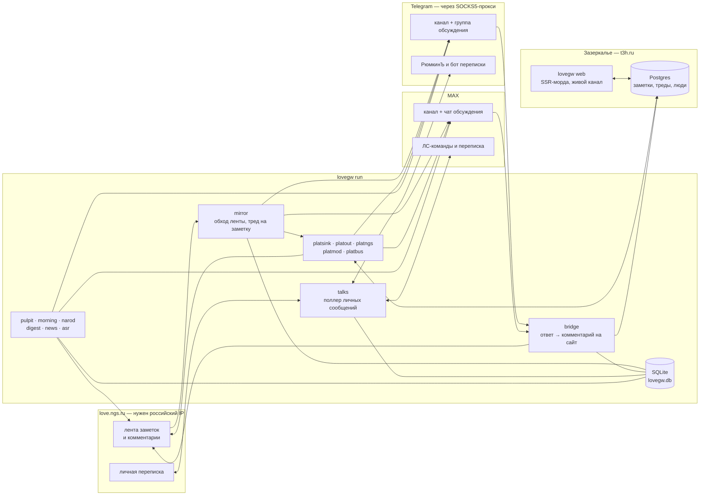

# lovegw


**Шлюз между разделом «заметки» сайта знакомств love.ngs.ru и мессенджерами —
и собственная площадка «Зазеркалье», куда сообществу можно переехать.**

Заметки и комментарии зеркалятся в каналы Telegram и MAX; ответ в группе
обсуждения уходит обратно на сайт комментарием от имени написавшего — по его
сохранённой сессии. Третьим приёмником того же зеркала работает **своя
площадка** (`t3h.ru`, Postgres + SSR-морда): там можно читать без регистрации,
входить по коду из анкеты НГС, писать заметки и отвечать в тредах, а написанное
здесь уносит обратно в каналы исходящий обход — и, по отдельной галочке, на сам
НГС. Рядом живут ЛС-бот **РюмкинЪ** (вход на сайт, публикация заметок,
подписки), доставка личной переписки сайта в мессенджер, еженедельный дайджест,
расшифровка голосовых, «амвон» и утренняя заметка, эмуляция сообщества
(«жители») и офлайн-архив с аналитикой «персонажей».

Написан на Go (модуль `lovegw`, каталог [`go/`](go/)). Хранилище зеркала —
SQLite без CGo; запись сквозная, поэтому состояние переживает `kill -9`.
Площадка — Postgres через `pgx` (тоже CGo-free, так что образ остаётся
distroless). Скрапинг — `net/http` + goquery по HTML сайта.



Отдельно от демона у того же бинарника есть офлайн-слой: массовая выгрузка
заметок в `archive.db`, распознавание личностей (склейка альт-анкет, интересы,
отношения, атрибуция авторства) и наблюдатель за действиями модерации.

---

## Что умеет

| Что | Как это устроено |
| --- | --- |
| **Зеркало** | лента → пост в канале, комментарии → тред; свой поток на заметку с адаптивным интервалом. Комментарий постится реплаем адресату («Ник, …»), поэтому мессенджер рисует цитату |
| **Мост ответов** | ответ в группе обсуждения → комментарий на сайте под сессией автора; at-most-once через `processed_replies`. Отказ сайта — не конец пути: ответ уходит на площадку |
| **Три приёмника** | Telegram, MAX и площадка работают параллельно и независимо (`Sink`). В MAX нет нативных комментариев к каналу — тред бот заводит сам |
| **Своя площадка** | «Зазеркалье» на Postgres: чтение открыто всем, вход по коду из анкеты НГС, заметки и треды, реакции, модерация, шина событий, живой добор страницы без перезагрузки |
| **Обратный ход** | написанное на площадке уносит в каналы `platout`, а по галочке участника — и на сам НГС (`platngs`), сессией самого человека; эхо гасится на приёме зеркала |
| **ЛС-бот РюмкинЪ** | `/login`, `/site`, `/add_note`, `/add_anonymous_note`, `/status`, `/subscribe`, `/unsubscribe`, `/mysubs`, `/delivery`, `/profile` + кнопочное меню |
| **Подписки** | по слову, на автора и на комментарии конкретной заметки; подписка заводится прямо из-под поста в канале, отписка — кнопкой в уведомлении |
| **Личная переписка** | входящие ЛС сайта приходят в мессенджер, ответ реплаем уходит обратно; `/talks`, `/talk`, `/delivery`. Читается только с согласия человека (чтение помечает ЛС прочитанными на сайте), получатель у сайт-аккаунта ровно один |
| **Дайджест** | еженедельный выпуск (суббота 09:00 Нск): метрики по площадке (или по зеркалу, если её нет) + рубрики от LLM; выходит заметкой на площадке, в каналы её относит `platout` |
| **Модерация площадки** | пост-модерация: автомат (`platmod`) вправе только скрыть и только по закрытому списку категорий ядра, решения о людях — у человека; страницы `/mod`, журнал, жалобы, пересмотр |
| **Амвон** | своя реплика владельца под каждой новой заметкой сайта, и по возможности первая; предохранитель гасит службу, если реплики не появляются или их чистят |
| **Утренняя заметка** | одна «доброе утро» в сутки на НГС от анкеты владельца, поводы дня — из интернет-календарей; если утро сегодня уже написал человек, служба молчит |
| **Жители** | эмуляция сообщества: персонажи с характером, памятью и отношениями говорят в «песочнице» площадки; калибровка идёт реплеем архивных тредов |
| **Голосовые** | расшифровка голосовых и кружков в тредах (Nexara + ffmpeg), кэш и суточная квота на пользователя. Только Telegram — в MAX расшифровка встроена в клиент |
| **Архив и аналитика** | `archive.db`: выгрузка заметок, склейка альт-анкет, атрибуция авторства, интересы и отношения, HTML-отчёт |
| **Наблюдатель модерации** | `modwatch` ловит удаления и закрытия онлайн, сверяет их с присутствием людей, выводит запреты из ритма жертвы |

---

## Быстрый старт

```sh
cd go
cp config.example.json config.json    # заполнить токены и id каналов
go build ./...
go run ./cmd/lovegw doctor            # конфиг, БД, сайт, токены, очередь
go run ./cmd/lovegw run -seed         # первый запуск: запомнить ленту без постинга
go run ./cmd/lovegw run               # демон
```

`-seed` нужен ровно один раз: при пустой БД запуск без него опубликует всю
текущую ленту залпом. На Windows демоном управляют батники
[`go/start.bat`](go/start.bat) / `stop.bat` / `status.bat` / `restart.bat`
(сквозная запись в SQLite делает жёсткое убийство безопасным), наблюдателем —
`modwatch-start.bat` / `modwatch-stop.bat` / `modwatch-status.bat`.

Площадка поднимается отдельно и в два шага — схема руками, потом морда:

```sh
go run ./cmd/lovegw platform migrate   # накатить схему Postgres
go run ./cmd/lovegw platform doctor    # пул, версия схемы, наполнение, режим живого канала
go run ./cmd/lovegw web                # SSR-морда (в бою — свой контейнер)
```

> [!IMPORTANT]
> **Сеть раздвоена.** love.ngs.ru за геоблоком DDoS-Guard: с не-российского IP —
> 403, поэтому демон и все команды, ходящие на сайт, работают с российского
> адреса. Telegram Bot API из России, наоборот, заблокирован — задайте
> `telegram_proxy`, и через прокси пойдёт только Bot API (и Claude API), а сайт
> останется напрямую. Российский LLM-провайдер (`rullm`, Yandex AI Studio) идёт
> тоже напрямую. Бокс, который видит и то и другое, не требует ничего.

---

## Площадка «Зазеркалье»

Собственный сайт сообщества на домене `t3h.ru`: своё хранилище (Postgres), своя
SSR-морда, свои правила. Заводилась она затем, чтобы сообществу было куда
переехать, если НГС закроет «Заметки», — поэтому мера здесь не «красивый
дизайн», а **«человек не заметил переезда»**: вид, числа и порядок элементов
перенесены с love.ngs.ru по замерам и закреплены тестами
(`internal/web/fidelity_test.go`).

- **Полосы идентификаторов** — фундамент. `[1..1e11)` — записи НГС, где id
  строки РАВЕН id на сайте; `[1e11..2e11)` — нативные, написанные здесь;
  `[2e11..3e11)` — восстановленное из чужих зеркал (дамп 2010 года). Колонок
  `source`/`external_id` нет намеренно: дискриминатор в самом ключе, значит
  рассинхронизировать его нельзя, а `/n/312811` совпадает с адресом заметки на
  НГС.
- **Чтение открыто всем**, включая поисковики (карта сайта, канонический адрес
  заметки). Закрытым остаётся личное и служебное — один список
  `web.privateRoots` и на заголовок `X-Robots-Tag`, и на `robots.txt`.
- **Вход** — код `T3H-XXXX-XXXX` в поле «о себе» анкеты НГС (проверка
  двусторонняя: кода в публичной анкете мало, нужна ещё кука того, кто проверку
  начал), ссылка из бота (`/site` у РюмкинЪа — ключ идёт БОТ → ЧЕЛОВЕК →
  ПЛОЩАДКА, пароля сайта форма не спрашивает никогда) или приглашение.
- **Запись** — заметка (в том числе анонимная), картинка к ней, ответ в любую
  точку дерева, реакции. Правка своей заметки — 10 минут, один раз и только
  пока под ней нет ответов; чужой текст правит только администратор.
- **Согласий два** (общее и на распространение), тексты вшиты файлами и
  неизменяемы после публикации: расхождение при том же номере версии — отказ
  `platform migrate`. Публиковать можно только по действующей редакции.
- **Модерация** — пост-модерация. Автомат вправе ТОЛЬКО скрыть и только по
  закрытому списку категорий, живущему в ядре; у ложного срабатывания есть
  кнопка «на пересмотр», каждое решение пишется в `audit_log` той же
  транзакцией. Провайдер модели российский — это обещано в согласии.
- **Шина событий** разводит ФАКТ (`events`, append-only), ПОВОД
  (`notifications`) и КАНАЛ; о новом морда узнаёт `NOTIFY`-звонком, а страница
  дописывает себя готовой разметкой без перезагрузки (`/live`, `/fresh`).
- **Права субъекта** — выгрузка и обезличивание командой (обе идут по всем
  публикациям человека, вторая необратима), отзыв согласия — кнопкой на `/me`.

```sh
lovegw platform migrate                    # схема; накатывает админ в известный момент
lovegw platform doctor                     # пул, версия схемы, наполнение, режим живого канала
lovegw platform reconcile [-db lovegw.db]  # сверка зеркала с площадкой; она же бэкфилл
lovegw platform media [-limit N]           # добор байтов медиа по известным ссылкам
lovegw platform avatar <id> …              # фото человека из анкеты НГС
lovegw platform gender <id> …              # пол человека из анкеты НГС
lovegw platform reply-scan [-limit N] [-note ID]            # настоящее дерево ответов и пол из мобильной версии
lovegw platform post -body <файл|-> [-pin] [-author <id>]   # объявление площадки нативной заметкой
lovegw platform invite [-bind <user_id>] [-days N]          # приглашение (обычно — со страницы /mod/admin)
lovegw platform role <user_id> user|moderator|admin
lovegw platform moderation [-limit N]      # сводка очереди и последние решения
lovegw platform triage [-limit N] [-model …]                # стенд классификатора: что БЫ он сделал
lovegw platform ban <id> [-days N] [-reason "…"] | unban <id>
lovegw platform events                     # разовый проход раздачи поводов + сводка
lovegw platform export <id> [-out файл]    # выгрузка данных человека
lovegw platform anonymize <id> -yes        # обезличивание, НЕОБРАТИМО
lovegw platform import-archive   -archive archive.db        # разовая раскатка archive.db
lovegw platform import-restored  -archive archive.db        # добор восстановленной эпохи 2010 года
lovegw web                                 # SSR-морда
```

`reconcile` безопасна при работающем демоне (приём идемпотентен по id, SQLite
только читается) — он и сам крутит её раз в пять минут; гонять её надо **на
хосте**, а не через ssh-туннель: это десятки тысяч транзакций, и решает RTT.
`triage` ничего не меняет и не тратит суточный потолок, поэтому им и сравнивают
провайдеров и модели на одних данных.

> [!WARNING]
> Раскатка архива ради скорости **снимает четыре индекса `comments` и собирает
> их заново**. На это время страница треда идёт перебором и упирается в таймаут
> прокси — **502 на `/n/<id>` во время раскатки штатен**, лента при этом жива.
> Операция идемпотентна и резюмируема: порция — заметка целиком вместе с тредом
> в одной транзакции.

---

## Жители площадки («народ»)

Эмуляция сообщества, а не генератор комментариев для оживления ленты: у
персонажа есть характер, память и отношения, и меняются они от треда к треду.
Говорят жители только в **песочнице** — заметке с признаком `notes.stage`, — и
наружу из неё не уходит ничего: ни в каналы, ни в выпуск, ни в поводы, ни на
НГС. Читателю про машину говорит значок песочницы у заметки и раздел
`/help#narod`.

Карточек два сорта, и различие правовое: **слепок** — портрет реального
участника архива, живёт только в офлайн-калибровке; **композит** — житель, у
которого числовые цели смешаны из нескольких доноров, дословных образцов нет
вовсе, а ник и биографию пишет владелец. Наружу выходят только композиты, и
правило это стоит в коде дважды.

```sh
lovegw narod card <p<id>|u<id>> [-recent N] [-j N]       # слепок донора: манера, ритм, задержки, ошибки
lovegw narod compose <рецепт> [-verify]                  # житель из слепков + сторож близости к донорам
lovegw narod show [файл …]                               # карточка ровно так, как её увидит модель
lovegw narod scout [-with u1,u2] [-min-comments N] [-top N]        # кандидаты в состав, столбец «влезет»
lovegw narod world                                       # состояние мира
lovegw narod portrait [<слуг> …] [-to dir] [-mj]         # английский промпт для генерации аватара
lovegw narod enroll <слуг>                               # анкета жителя на площадке + строка в мире
lovegw narod seed -body <файл|-> | -from <id>            # завести песочницу
lovegw narod stage -id <номер> [-off]                    # перевести в песочницу уже стоящую заметку
lovegw narod twin -id <номер>                            # смежное обсуждение рядом с живой заметкой
lovegw narod wake -id <номер>                            # вернуть затихший тред в живые
lovegw narod replay -actor u<id> [-threads N] [-seeds N] [-speak]  # калибровка: слепок на месте человека
lovegw narod replay -mode vacuum -actor u1,u2,u3 [-max-replies N]  # разговор жителей с нуля
lovegw narod speech -file <наши.json> -actor u<id> -note <id>      # мера СОДЕРЖАНИЯ реплик
lovegw narod stamps -file <по файлу на тред> [-corpus N]           # свод штампов машины против корпуса
```

Ни сайта, ни Postgres калибровочные команды не трогают вовсе — читается только
`archive.db`, поэтому гонять их можно на рабочей машине. Без `-speak` прогон
**бесплатен**: считается матрица решений («прийти или смолчать»), а модель зовут
только на текст. Тумблер «работает сейчас» — команда `/narod` в ЛС (админская, в
меню команд не значится).

> [!NOTE]
> Одно зерно — это бросок, а не замер: пять зёрен на одних и тех же тредах дают
> разброс в полтора-два раза, поэтому правка кубика считается удачной, только
> если вывела число ЗА разброс. Отчёт печатает таблицу по зёрнам всегда.

---

## Амвон и утренняя заметка

Две службы, которые пишут на love.ngs.ru от анкеты владельца. Обе выключены по
умолчанию, и у обеих гейт в конфиге («поднимать ли службу») отделён от тумблера
в БД («работает ли она сейчас»): выключает автоматика, включает админ кнопкой в
ЛС, и переключение обязано пережить рестарт.

```sh
lovegw pulpit draft <note_id> [<note_id> …]   # черновик реплики, на сайт ничего не уходит
lovegw pulpit status                          # включён ли амвон, что писал последним

lovegw morning sources [-day 2026-08-24]      # поводы дня: что отдали календари и что срезал фильтр
lovegw morning draft   [-day 2026-08-24]      # черновик утренней заметки, на сайт ничего не уходит
lovegw morning post    [-force]               # ручной догон дня
lovegw morning status
```

**Амвон** — собственная реплика под каждой новой заметкой, и по возможности
первая: свой обход ленты и свой клиент сайта, потому что у общего лимитер один
на всё. Голос — прикольщик, форма — приёмы стендапа с короткими образцами,
реплика пишется в два прохода (черновик → правка, режущая всё после панча). Под
настоящей бедой служба возвращает отказ шутить. Предохранитель гасит фичу, если
реплики перестали появляться в тредах или их вычищают: запрет писать в раздел
ничего не убирает с площадки и виден только так.

**Утренняя заметка** выходит на НГС (05:00 Нск), а на площадку и в каналы её
приносит зеркало — отдельного пути публикации нет и не нужно. Поводы дня берутся
из нескольких интернет-календарей и только НАЗВАНИЯМИ: факт «сегодня день
вафель» никому не принадлежит, а абзац про историю вафель — принадлежит. Что
годится в «доброе утро», решает закрытый список в коде. **Если утро сегодня уже
написал кто-то другой — служба молчит** и говорит об этом владельцу в ЛС.

---

## Конфигурация

Конфиг — `go/config.json` (шаблон
[`go/config.example.json`](go/config.example.json), сам файл в `.gitignore`).
Секции:

| Секция | О чём |
| --- | --- |
| `site` | базовый URL, User-Agent, интервал запросов |
| `messengers.telegram` / `messengers.max` | гейт `enabled` + токены, id канала, чата обсуждения и админа. Старый плоский формат `mirror_bot`/`dm_bot` по-прежнему грузится как telegram-only |
| `platform` | своя площадка: `enabled`, `dsn`, `listen`, `base_url`, `media_dir`, реквизиты оператора, `contacts`; подсекции `moderation` (автомат), `bus` (шина событий), `shots` (картинки к заметкам) |
| `talks` | личная переписка: интервалы, лимиты, `allow_send`, `store_text`, `retention_days`, `exclude_users` |
| `digest` | слот выпуска (`weekday`, `hour`, `tz`), `out_dir`, `auto_publish`, `author_profile_id` |
| `pulpit` | амвон: `enabled`, анкета владельца, свежесть, бюджеты, пороги длины, потолки ответов |
| `morning` | утренняя заметка: `enabled`, автор, слот, пороги длины, список календарей, предохранитель |
| `narod` | жители: `enabled`, `mode` (`dry-run` / `live`), каталог карточек, база мира, зерно, потолки, доли ходов реплики |
| `llm` | ключ Claude API, модель, потолок токенов — рубрики дайджеста, амвон, утро, жители |
| `asr` | распознавание голосовых: провайдер, ключ, путь к ffmpeg, потолок длительности, суточная квота |
| корень | `notes_limit`, `signature`, `feed_interval_s`, `db_path`, `accounts_db_path`, `secret_key`, `log_level`, `telegram_proxy` |

Оба умолчания у `narod` выбраны так, чтобы забытая секция не могла ничего
опубликовать: выключено и сухо. `platform.moderation.enabled` выключен по тому
же складу мысли — автомат тратит деньги на каждую публикацию, а очередь
модератора живёт и без него.

Секреты можно не класть в файл — они читаются из окружения:

| Переменная | Что задаёт |
| --- | --- |
| `LOVEGW_MIRROR_TOKEN` / `LOVEGW_DM_TOKEN` / `LOVEGW_TG_TALKS_TOKEN` | Telegram: постер, РюмкинЪ, бот переписки |
| `LOVEGW_MAX_TOKEN` / `LOVEGW_MAX_TALKS_TOKEN` | MAX: бот зеркала, бот переписки (`LOVEGW_MAX_DM_TOKEN` — устаревший псевдоним) |
| `LOVEGW_TG_PROXY` | прокси для Bot API (`http`/`https`/`socks5://…`) |
| `LOVEGW_DB_PATH` / `LOVEGW_ACCOUNTS_DB` | путь к боевой БД; база сервисных аккаунтов |
| `LOVEGW_SECRET_KEY` / `LOVEGW_SECRET_KEY_FILE` | ключ шифрования cookie-сессий на диске |
| `LOVEGW_LLM_KEY` | ключ Claude API |
| `LOVEGW_PLATFORM_ENABLED` / `_DSN` / `_LISTEN` / `_BASE_URL` / `_MEDIA_DIR` / `_OPERATOR` / `_CONTACT` | площадка. DSN держит пароль, поэтому боевое его место — env, а не файл: конфиг монтируется и попадает в бэкапы каталога развёртывания |
| `LOVEGW_MODERATION_ENABLED` / `_PROVIDER` / `_KEY` / `_FOLDER` / `_MODEL` / `_DAILY_REQUESTS` | автомат модерации |
| `LOVEGW_PULPIT_ENABLED` / `_MODEL` / `_REPLY_PROBABILITY` | амвон |
| `LOVEGW_MORNING_ENABLED` / `_MODEL` / `_HOUR` | утренняя заметка |
| `LOVEGW_NAROD_ENABLED` / `_MODE` / `_MODEL` | жители |
| `LOVEGW_ASR_*` | `ENABLED`, `PROVIDER`, `BASE_URL`, `API_KEY`, `FFMPEG`, `MAX_DURATION_SEC`, `USER_DAILY_LIMIT_SEC`, `CONCURRENCY`, `TIMEOUT_SEC` |

**Роли ботов.** Всё, что было до личной переписки, остаётся на исходных ботах
(постер + РюмкинЪ в Telegram, бот зеркала в MAX). `talks_token` уводит на
отдельного бота только переписку сайта и алерты админу; без него ничего не
меняется.

---

## Команды

Все команды — подкоманды одного бинарника: `go run ./cmd/lovegw <команда> …`
(или собранный `lovegw <команда> …`). Флаги можно писать и до, и после
позиционных аргументов (`crawl notes -save-html dir` работает). У всех команд,
читающих конфиг, есть `-config config.json` — путь относительный, поэтому
запускать удобнее из `go/`.

| Команда | Зачем |
| --- | --- |
| [`run`](#демон-и-эксплуатация) | боевой демон: зеркало, мост, ЛС-боты, переписка, площадка, службы |
| [`doctor`](#демон-и-эксплуатация) | диагностика конфига, БД, сайта, токенов, очереди |
| [`pull`](#демон-и-эксплуатация) | завести заметку по прямому id, минуя ленту |
| [`repost`](#демон-и-эксплуатация) | снести заметку из мессенджера и БД для перепоста |
| [`alert`](#демон-и-эксплуатация) | сообщение владельцу в ЛС из внешнего скрипта |
| [`import`](#демон-и-эксплуатация) | разовый импорт состояния Python-версии |
| [`platform`](#площадка-зазеркалье) · [`web`](#площадка-зазеркалье) | схема, диагностика, сверка и обслуживание площадки; SSR-морда |
| [`narod`](#жители-площадки-народ) | жители: слепки, композиты, песочница, калибровка |
| [`pulpit`](#амвон-и-утренняя-заметка) · [`morning`](#амвон-и-утренняя-заметка) | амвон и утренняя заметка: черновики и состояние |
| [`digest`](#дайджест) | недельный выпуск: `draft` → правка → `preview` → `publish` |
| [`talks watch`](#личная-переписка) | безопасный read-only прогон поллера переписки |
| [`account`](#сервисные-аккаунты-и-секреты) · [`secrets`](#сервисные-аккаунты-и-секреты) | технические сессии сайта; шифрование кук на диске |
| [`crawl`](#отладка-парсинга) | разобрать ленту/комментарии, записать фикстуры |
| [`grab` · `export` · `backfill`](#архив-archivedb) | офлайн-архив заметок |
| [`personas …`](#персонажи-personas) | аналитика поверх архива |
| [`modwatch`](#наблюдатель-модерации-modwatch) | ловля действий модерации, запретов и присутствия |

### Демон и эксплуатация

```sh
lovegw run    [-seed]
lovegw doctor [-post-test]
lovegw pull   [-db lovegw.db] [-full] <note_id> [<note_id> …]
lovegw repost <note_id> [<note_id> …]
lovegw alert  [текст …]
lovegw import [-notes notes.json] [-sessions sessions_export.json] [-subscribers subscribers.json]
```

- **`run`** — зеркалирование ленты и комментариев, мост «ответ в группе →
  комментарий на сайте», ЛС-боты, поллер переписки, приёмник и сверка площадки,
  исходящий обход в каналы, вынос на НГС, шина событий, автомат модерации,
  планировщик дайджеста, амвон, утренняя заметка, жители и распознавание
  голосовых — всё под одним errgroup. Что именно поднимется, решают гейты
  `enabled` в конфиге.
- **`doctor`** — конфиг, БД, доступ к сайту, токены ботов, очередь обновлений.
  `-post-test` дополнительно проверяет цепочку «пост в канал → автофорвард в
  группу» тихим самоудаляющимся сообщением (безопасно на живом канале).
- **`pull`** — спасение заметки, которую не увидел обход ленты (уехала из окна
  за время простоя): заводит её по прямому id со статусом `pending`, дальше
  работает обычная логика демона. `-full` дотягивает весь тред и возвращает
  архивную заметку в отслеживание. Безопасна при работающем демоне.
- **`repost`** — удаляет заметку из мессенджера (пост, тред, комментарии,
  иллюстрации) и из БД, чтобы демон опубликовал её заново по текущей логике.
  Отладочная команда — запускать при остановленном демоне.
- **`alert`** — сообщение владельцу в ЛС из внешнего скрипта (без аргументов
  текст читается со stdin). Заведена для бэкапа: он живёт в кроне на хосте, и
  его отказ иначе виден только тому, кто пойдёт читать лог.
- **`import`** — разовый идемпотентный импорт JSON-состояния старой
  Python-версии (`INSERT OR IGNORE`); можно указывать любое подмножество файлов.

### Дайджест

```sh
lovegw digest [-db lovegw.db] [-week N] [-out dir] [-llm] [-force] draft
lovegw digest [-db lovegw.db] [-week N] [-in draft.txt] [-to telegram|max] preview
lovegw digest [-db lovegw.db] [-week N] [-in draft.txt] [-to telegram|max] publish
```

Слот выпуска — **суббота 09:00 Нск**: он задаёт и время публикации, и шов
недели, поэтому стоит в утренней тишине (вечерний срез рассекал бы суточный пик
21:00–22:00 пополам). `draft` считает рубрики (заметка недели, спор, цитата,
новые лица, рекорды) **по площадке**, если она настроена, иначе по зеркалу НГС,
и кладёт рядом `materials.md` с промптами; `-llm` заполняет рубрики моделью,
иначе их заполняет админ вручную. `preview` показывает тело заметки-выпуска и
разбиение по мессенджерам, `publish` публикует выпуск **заметкой на площадке** —
в каналы её отнесёт исходящий обход демона. `-to telegram|max` — прежний путь
прямо в канал, он же работает, когда площадки нет.

Публикация идемпотентна и резюмируема через `message_targets`, поллинг команда
не поднимает — запускать можно при работающем демоне. Сравнительные рекорды
считаются за год, а не за всю историю: в базе архив с 2009-го, и «рекорд за всё
время» — это тред 2013 года, который не побьют никогда.

При `digest.enabled` планировщик делает это сам: в слот строит черновик, при
настроенной секции `llm` заполняет рубрики, и либо публикует (`auto_publish`),
либо зовёт админа в ЛС. Пропущенный слот догоняется в течение 48 часов.

### Личная переписка

```sh
lovegw talks -db <копия.db> [-once] [-interval 20s] [-max-dialogs N] [-history-limit N] watch
```

Прогон **только** поллера ЛС, без зеркала и без long polling: читает диалоги под
сессией админа и доставляет входящие в его личку методом `SendMessage`, поэтому
не конфликтует с боевым демоном на тех же токенах. Жёстко read-only:
`allow_send=false`, на сайт ничего не пишется. Работает по **копии** БД —
открытие мигрирует схему.

> [!WARNING]
> Переписку читают **только с согласия человека**: чтение истории помечает
> сообщение прочитанным на самом сайте (собеседник видит «просмотрено») и всё
> это время показывает человека в сети. Пока согласия нет, сайт-аккаунт не
> трогают вовсе, а бот один раз спрашивает кнопками — у CLI кнопок нет, поэтому
> `talks watch` обходит только согласившихся.
>
> У сайт-аккаунта при этом ровно один получатель ЛС: второй сессии того же
> человека достанется пустота. Кнопка «читать и присылать сюда» отвечает сразу
> на оба вопроса, дальше настройка живёт под `/delivery`.

### Сервисные аккаунты и секреты

```sh
lovegw account -name reserve [-purpose "…"] login    # вход (логин/пароль со stdin)
lovegw account list | check | forget | cookie
lovegw account -name reserve -note <id> [-reply <comment_id>] [-yes] say "текст"

lovegw secrets keygen                    # новый ключ шифрования сессий
lovegw secrets status                    # что лежит открыто, что зашифровано
lovegw secrets [-old-key-env NAME] encrypt
```

**Сервисный аккаунт** — вторая, техническая анкета сайта: резервный доступ для
обходов под авторизацией и редких ручных комментариев. Живут они в своей
`accounts.db`, ботам не видны и в обход личных сообщений не попадают — иначе
служебная строка немедленно начала бы гасить непрочитанное на сайте. `account
cookie` пишет заголовок только в пайп, не в терминал.

**Шифрование** (`secret`, AES-256-GCM) накрывает cookie-сессии в `sessions` и
`accounts`. Ключ живёт ВНЕ базы — в этом весь смысл: защищает он ровно копии и
бэкапы, а не хост, где лежит рядом. После шифрования ключ обязателен: любая
команда, открывающая боевую БД, падает, если записи не открываются, — иначе
демон молча выдал бы всем «сессия истекла».

### Отладка парсинга

```sh
lovegw crawl notes                [-save-html dir]
lovegw crawl comments <note_id>   [-save-html dir]
```

Разбирает ленту или страницу комментариев и печатает JSON. `-save-html`
записывает сырую страницу как фикстуру парсера — при дрейфе вёрстки
перезаписывайте фикстуры в `internal/love/testdata/` этой же командой:

```sh
lovegw crawl notes -save-html internal/love/testdata
lovegw crawl comments <note_id> -save-html internal/love/testdata
```

### Наблюдатель модерации (modwatch)

```sh
lovegw modwatch [-db modwatch.db] [-feed-interval 90s] [-thread-interval 5m] [-window 48h]
                [-depth 6h] [-max-threads N] [-pages N] [-once] watch
lovegw modwatch [-db modwatch.db] [-since 72h] [-until …] [-kind note_gone,comment_gone,…]
                [-age-min D] [-age-max D] [-presence-window 5m] [-controls N] [-min-hits N] [-top N] report
lovegw modwatch [-db modwatch.db] [-since 72h] [-kind …] [-limit N] events
lovegw modwatch [-db modwatch.db] status
lovegw modwatch [-db modwatch.db] [-tolerance 3h] [-max-window 1h] bans
lovegw modwatch [-interval 15m] [-once] guests watch | [-near "…"] [-window 30m] guests log
lovegw modwatch [-source lovegw.db] [-interval 10m] [-batch N] activity watch | activity scan
lovegw modwatch [-silence 72h] [-fresh 24h] [-min-missed 20] activity report | [-near "…"] activity log
```

Поля «модератор» на сайте нет, а архив хранит только уцелевшее — что именно
исчезло, видно лишь онлайн. `watch` пишет в **отдельную** `modwatch.db` моменты,
которых нет в архиве: заметка появилась или ушла из ленты, комментарий пропал
из треда, добавилась иллюстрация, закрыли комментарии, сменился ник — с окном
неопределённости и контекстом действия (возраст объекта, тишина в треде,
число реплик). `report` сверяет эти минуты с присутствием людей: для каждого
события окно сравнивается с контрольными, сдвинутыми на целые сутки и
выровненными по числу реплик. `bans` выводит окна суточных запретов из ритма
жертвы — это кандидаты, а не находки: слепой поиск не отличает запрет от паузы.

`activity` — второй, отдельный канал. Запрет писать в «Заметки» ничего не
убирает с площадки и потому в событиях невидим, зато в анкете есть живая отметка
последнего захода: «молчит, но ходит» = закрыли, «молчит и не заходит» = ушёл.
`guests` копит визиты в свою анкету под своей сессией. Сайт только читается,
боевую БД трогает лишь `activity` и только на чтение реплик, с работающим
демоном всё совместимо.

> [!NOTE]
> Единица наблюдения — **окказия** (заметка + такт опроса), а не событие: чистку
> треда наблюдатель видит разом. Верхушку отчёта нельзя читать как список имён —
> порог не откалиброван на множественную проверку, а анкеты, живущие меньше
> периода наблюдения, не попадают в контроль и получают значимость даром.

### Архив (archive.db)

Отдельная БД (по умолчанию `data/archive.db`, флаг `-db`) для офлайн-анализа:
users/notes/comments, дерево ответов через `parent_id`, типажи дедуплицированы
по id анкеты.

```sh
lovegw grab   [-db archive.db] [-json] [-out dir] [-save-html dir] [-view tree|linear] [-max-pages N] <note_id>
lovegw export [-db archive.db] [-out dir] <note_id>
lovegw backfill [-db archive.db] [-proxy] [-workers N] [-interval-ms MS] [-from ID] [-to ID]
                [-start-page N] [-refresh] [-limit N]
```

- **`grab`** — разовая выгрузка одной заметки со всеми страницами комментариев
  с сайта в `archive.db` (только чтение, без кук). `-json` дополнительно пишет
  денормализованный снимок `<id>.json` в `-out`.
- **`export`** — полностью офлайн: собирает заметку из `archive.db` во
  вложенное JSON-дерево `<id>.json` (для визуализаций и внешних инструментов).
- **`backfill`** — массовая выгрузка диапазона: перечисляет живые id обходом
  ленты и внахлёст скармливает их пулу воркеров. Идемпотентна — после остановки
  или 403 достаточно перезапустить. `-proxy` гонит сайт через `telegram_proxy`
  (беречь основной IP), `-from`/`-to` — границы id (по умолчанию от 240866 —
  старее комментарии уже удалены с самого сайта), `-start-page` — с какой
  страницы ленты начинать, `-refresh` — пере-обходить уже загруженные (нужен,
  чтобы подобрать новые комментарии в старых тредах).

### Персонажи (personas)

Слой распознавания личностей поверх `archive.db`: вероятностная, ревью-гейтед
склейка альт-анкет одного человека в «личности», плюс интересы, отношения,
атрибуция авторства и стилевые карты. Общие флаги: `-db archive.db`,
`-out dump` (каталог выгрузок).

Основной конвейер склейки — текстовые самораскрытия:

```sh
lovegw personas flag [-patterns file]        # скан комментариев по шаблонам самораскрытия → disclosure_hits
lovegw personas candidates [-limit N]        # выгрузка непроработанных помет с контекстом (hits.jsonl + users_index.json)
# … внешний LLM-проход по hits.jsonl → links.json …
lovegw personas link [-in links.json]        # импорт извлечённых связей в alias_candidates
lovegw personas cluster [-min-score F] [-max-persona N] [-min-density F]
                                             # склейка связных компонент в personas + отчёт
lovegw personas set <persona_id> <confirmed|rejected|pending>   # вердикт после ревью
```

`cluster` защищён гардами от транзитивной переклейки: `-max-persona`
(компонент крупнее — не склеивать) и `-min-density` (минимальная плотность
рёбер для компонент больше 4 анкет).

Слой адресатов и настоящее дерево ответов — фундамент всего социального графа:

```sh
lovegw personas addressees                                        # кому реально адресована каждая реплика
lovegw personas replies [-from ISO] [-limit N] [-max-comments N] [-retry]   # цели ответа с мобильной версии сайта
```

Дерево комментариев на сайте двухуровневое: `parent_id` указывает на корень
ветки, а настоящий адресат — в тексте («Ник, …»). `addressees` восстанавливает
его полным проходом по архиву (операция разовая и тяжёлая, пересчёт
идемпотентен), `replies` дополняет его точными парами «реплика → та, которой
отвечают» со страниц `m.love.ngs.ru`, где сайт эту связь отдаёт честно.

<details>
<summary><b>Дополнительные сигналы склейки и диагностика</b></summary>

```sh
lovegw personas avatars fetch  [-proxy] [-workers N] [-limit N] [-refresh]   # скачать аватары, посчитать dHash
lovegw personas avatars cluster [-max-dist D] [-generic-max N]               # пары по похожести аватаров
lovegw personas stylometry build   [-min-chars N] [-dims N] [-genre all|notes] # стилевые профили авторов
lovegw personas stylometry cluster [-min-cosine F] [-top-k N] [-max-pairs N] # пары по близости стиля
lovegw personas lexis build        [-lex-min-tokens N] [-lex-dims N] [-genre all|notes] # лексические TF-IDF-профили
lovegw personas ensemble [-ens-top-k N] [-handoff-days D] [-ens-floor F]     # композит: стиль + handoff + круг общения
```

```sh
lovegw personas portrait [-top N] <p<id>|u<id>|user_id>   # портрет личности/анкеты: стиль, собеседники
lovegw personas diag <id> <id> …                          # ground-truth сверка набора анкет (стиль/собеседники/время)
```

</details>

<details>
<summary><b>Атрибуция авторства: attribute · calibrate · verify · anon</b></summary>

```sh
lovegw personas attribute [-top N] [-note id] [-in text.txt] [-lex-weight F] [-active-days N]
                          [-min-author-notes N] [-genre notes] [текст …]
                          # чьё письмо ближе к анонимному тексту (стиль + лексика);
                          # -active-days убирает мёртвые анкеты, -min-author-notes — чистых
                          # комментаторов без заметок (атрибутируем-то заметку)
lovegw personas attribute [-author p<id>] [-lex-weight F] [-genre notes]   # пакет: все заметки личности + сводка попаданий
lovegw personas calibrate -notes id,id,… [-author p<id>] [-active-days N] [-min-author-notes N] [-genre notes]
                          # leave-one-out: предсказуемость автора и эффект фильтров
lovegw personas verify -suspect p<id> [-in txt|-notes ids|-note id] [-null N] [-active-days N]
                       [-min-author-notes N] [-genre notes]
                          # «это он? да/нет» с калиброванным порогом (FPR 5 %/1 %)
lovegw personas anon -suspect p<id> [-from ISO] [-to ISO] [-min-text N] [-top N] [-null N]
                          # прогнать анонимные заметки через скоринг подозреваемого
```

**Жанр эталона `-genre`** (по умолчанию `all` — комментарии + заметки, обратная
совместимость): у большинства авторов профиль на 2/3 состоит из комментариев —
другой жанр, чем заметка-запрос (короткая реплика vs текст), и это системная
ошибка сопоставления. `-genre notes` строит и грузит эталон **только из
заметок** (register-matched): и запрос, и профиль — один регистр. Note-слой есть
только у писавших заметки, поэтому `-min-author-notes` для него встроен по
построению. Порядок: сначала `stylometry build -genre notes` (+ при желании
`lexis build -genre notes`), затем `attribute/calibrate/verify -genre notes`.

Выдача `anon` читается только вместе с ожидаемым числом ложных срабатываний и
контролем — вторым автором той же эпохи.

</details>

<details>
<summary><b>Манера письма и генерация в чужом голосе (voice)</b></summary>

```sh
lovegw personas voice card <p<id>|u<id>|user_id> [-genre notes|all] [-recent N]
                           [-samples N] [-band N] [-seed N] [-top-words N] [-solo]
```

Профили атрибуции — хешированные необратимые векторы: по ним нельзя ни сказать,
как звучит человек, ни проверить их глазами. `voice card` меряет манеру по
сырому тексту: квантили длин, предложения и абзацы, пунктуация на 1000 рун,
**скобочная подпись** отдельно от частот («)» и «))» — разные люди), регистр и
финальный знак, разметка сайта и смайлы, обращения «Ник, …», часы активности и
характерная лексика. Карта детерминирована: тот же `-seed` на той же БД даёт ту
же выборку. LLM и конфиг не нужны. `-solo` меряет **одну анкету**, без склейки
личности — иначе карта усредняет все склеенные анкеты, в том числе чужих эпох.

Корпус режется на **образцы** (`-samples`) и непересекающийся **held-out**
(`-band`) — второй нужен замкнутому циклу генерации как эталонная полоса, и
пересечение сломало бы замер. `-samples 0` — режим, в котором дословные тексты
участника вообще никуда не уходят. `-recent` ограничивает замер последними
текстами (индекс `idx_comments_author` не покрывает `text`, у плотного
комментатора это десятки тысяч чтений с диска); в отчёте всегда видно и замер,
и полный знаменатель.

Вес характерных слов берётся у **корзины хэша** из готового `lexis_meta`, а не
у слова, — это экономит проход по 10,7 млн комментариев. Читать так: вес корзины
— нижняя оценка редкости слова (частое слово в корзине тянет его вниз), поэтому
верх списка надёжен, а низ не значит ничего.

```sh
lovegw personas voice note <token> [-topic "…"] [-drafts N] [-rounds N]
                           [-control p<id>] [-accept F] [-max-copy F]
lovegw personas voice comment <token> -reply-to <comment_id> [-control p<id>]
lovegw personas voice comment <token> -note <note_id>        [-control p<id>]
```

`-reply-to` — ответ внутри ветки (адресат и обращение «Ник,» подставляются
инструментом), `-note` — комментарий первого уровня к самой заметке: адресата
нет, а корневые реплики треда идут в промпт как «уже сказанное».

Образцы и словарь берутся от **рода** текста, который пишем, а не от жанра
эталона: комментарий учится на комментариях, даже когда слой атрибуции `all`.
Образец-реплика подаётся парой «на что отвечает → что ответил»: короткая реплика
в отрыве от чужих слов манеру не показывает. Число образцов по умолчанию
считается по медиане корпуса (короткие реплики — 24, средние — 12, длинные — 6).

Список характерных слов подаётся **не как цель**: рядом печатается норма самого
автора (слов из списка на 100 слов), дифф ругает и перебор, и недобор, а
черновик с частотой выше нормы ×3 отбраковывается до скоринга. Иначе модель
набивает список и поднимает лексический косинус, обрушив стилевой.

Карта и образцы уходят в Claude (`llm.api_key` / `LOVEGW_LLM_KEY`, через
`telegram_proxy`), K черновиков возвращаются одним запросом, каждый прогоняется
через **собственную атрибуцию архива**. Голый ранг ничего не значит — на
машинном тексте атрибуция заведомо слаба, — поэтому он читается против
**эталонной полосы**: рангов реальных held-out текстов того же человека.
Критерий приёмки — квантиль полосы (`-accept`, по умолчанию 0.25), а не порог
по рангу: у одного автора его собственные заметки лежат на 1–26, у другого на
40–3000.

Полоса **оптимистична**: её тексты входят в стиль-профиль автора, а черновик —
нет. Это считается (доля профиля, которую даёт один текст полосы) и печатается;
выше 5 % полоса не строится вовсе, и отчёт говорит почему. Кроме контаминации
полоса отказывается ещё в двух случаях: больше половины её текстов короче порога
объёма, либо её медиана лежит дальше половины списка — тогда слой не узнаёт и
настоящие тексты автора, и сравнивать не с чем.

`-control <token>` строит вторую полосу и скорит те же черновики против чужой
личности. Правило чтения: **если контроль не ниже цели, атрибутор на машинном
тексте людей не различает и вердикт цикла отбрасывается целиком.** Без
`-control` отчёт честно предупреждает, что прогон не интерпретируется.

Второй раунд получает не «попробуй ещё», а измеримый дифф: дельты длины,
предложений и пунктуации, отсутствующие «))», лишняя финальная точка,
неиспользованные характерные слова и слова, которых у автора нет ни разу.
Раундов максимум 3 — цикл взбирается по хешированной метрике, и дальше модель
начинает набивать признаки вместо манеры. Черновик, пересказывающий образец,
отбраковывается стражем копирования (`-max-copy`).

Инструмент исследовательский: пишет только в `<out>/voice/`, каждый артефакт
несёт марку машинной генерации, пути публикации на сайт или в мессенджеры нет
(закреплено тестом на список импортов, а не комментарием).

</details>

<details>
<summary><b>Интересы, отношения, пол анкет, итоговый отчёт</b></summary>

Факты (интересы) и отношения — тот же паттерн «scan/score → candidates →
внешний LLM → import»:

```sh
lovegw personas facts scan [-topics file] [-min-hits N] [-min-notes N] [-evidence N]
lovegw personas facts candidates [-min-hits N] [-min-notes N]      # → facts.jsonl на LLM-разметку
lovegw personas facts import [-in facts_llm.json]                  # → identity_facts

lovegw personas relations score [-rel-min-replies N]               # тон направленных пар по эвристикам
lovegw personas relations candidates [-cand-replies N] [-band-min N] [-band-top N] [-exchanges N]
                                                                   # → pairs.jsonl на LLM-разметку
lovegw personas relations import [-in relations_llm.json]          # → relation_edges
```

Пол анкет — обходом их профилей через мобильную версию сайта (десктопная банит
серию запросов почти мгновенно, мобильный vhost терпит):

```sh
lovegw personas gender [-active-days N] [-tg-user id] [-limit N]
```

Ходит под сессией сайта из БД бота (`-tg-user`, по умолчанию
`admin_tg_user_id`; нужен `/login` в РюмкинЪ). Идемпотентно — обходятся только
анкеты без пола, волны 403 пережидаются с нарастающей паузой, так что остаток
добирается простым перезапуском.

```sh
lovegw personas report [-report-top N] [-active-days N] [-html]
```

Сводка «персонажей»: топ личностей, интересы, отношения. `-active-days N`
ограничивает когорту активными за последние N суток, `-html` дополнительно
собирает `characters.html`.

</details>

---

## Развёртывание (Docker)

Всё живёт **на одном хосте вместе с площадкой**: площадку наполняет fan-out
внутри демона, значит писать в её Postgres обязан тот же процесс, что зеркалит,
а портов у базы наружу нет. Compose там один на семь сервисов —
[`deploy/platform/docker-compose.yml`](deploy/platform/docker-compose.yml):

| Сервис | Что делает |
| --- | --- |
| `postgres` | база площадки |
| `lovegw` | демон: зеркало, мост, боты, приёмник площадки, службы |
| `platform` | SSR-морда (`lovegw web`) — единственная, до чего дотягивается посторонний |
| `caddy` | TLS и отдача медиа мимо Go |
| `modwatch` | наблюдатель за действиями модерации (своя БД, сайт только на чтение) |
| `guests` | визиты в анкету владельца |
| `activity` | присутствие людей на сайте, детектор запретов в «Заметки» |

Для работы зеркала нужны первые два — остальные можно не поднимать. Границы
ресурсов (`cpus`, `mem_limit`, `GOMEMLIMIT`, `pids_limit`) выставлены **одной**
службе, морде, и порядок OOM задан явно: первой умирает она, последними Postgres
и демон.

**Образ на хосте не собирается**: на одном ядре `go build` идёт 25 минут и
уронил бы всё, что на этом хосте работает. Бинарник собирается снаружи и
приезжает готовым ([`Dockerfile.prebuilt`](deploy/platform/Dockerfile.prebuilt));
кнопочная выкатка (`workflow_dispatch`) живёт в
[`.github/workflows/deploy.yml`](.github/workflows/deploy.yml) — сборка у
раннера, `gzip | ssh`, `docker compose up -d`, healthz через Caddy и откат на
`lovegw:prev`, если морда не ответила. Артефакты и пошаговый рунбук — в
[`deploy/README.md`](deploy/README.md) и
[`deploy/platform/README.md`](deploy/platform/README.md).

Конфиг монтируется как `/config.json`, состояние — в `/data` (uid 65532:
distroless работает под `nonroot`), секреты — через env. У морды конфиг
**отдельный**: она смотрит в интернет, и ключа шифрования кук у неё нет.

> [!IMPORTANT]
> **Миграции роботом не накатываются никогда** — схему меняет админ в известный
> момент, отдельной командой `platform migrate`. Морда при расхождении версии
> схемы стартовать отказывается: работать по схеме, которой не знаешь, хуже, чем
> не подняться.

Хост нужен с **российским IP**; Telegram Bot API идёт через SOCKS5-прокси. При
включённом MAX PEM-ы Минцифры должны лежать в `go/internal/maxx/cacert/`
**до** сборки — в distroless-образе нет российского корневого CA (выкатка это
проверяет: сертификатов в бинарнике должно быть ровно два).

**Бэкапы** — [`deploy/platform/backup.sh`](deploy/platform/backup.sh) кроном в
01:30 МСК: `pg_dump -Fc --compress=zstd:3`, три базы SQLite онлайновым backup
API и `tar` хранилища медиа; хранится 7 дампов, 14 снимков SQLite, 2 копии
медиа. Восстановление отрепетировано отдельным скриптом
([`rehearse.sh`](deploy/platform/rehearse.sh)). Конфиги и `secrets.env` в
автоматический бэкап **не входят намеренно**: там ключ шифрования, и копия ключа
рядом с копией базы обнуляет защиту, которая охраняет ровно копии.

---

## Разработка

```sh
cd go
go build ./... && go vet ./... && go test ./...
```

`-race` требует cgo — гонять на Linux/CI. Тесты пакетов `platform`/`platsink`
идут против **настоящего** Postgres (`LOVEGW_TEST_PG_DSN`): половина решений
живёт в SQL, и проверить их иначе нечем — в CI база поднимается сервисным
контейнером `postgres:18-alpine`. Планы запросов — часть контракта: тест
спрашивает у Postgres `EXPLAIN` ровно того SQL, который выполняется, и требует
нужных индексов, потому что переезд на seq scan не провалил бы ни одного теста
на поведение, зато на живых данных это отказ.

[`.github/workflows/ci.yml`](.github/workflows/ci.yml) гоняет build/vet/тесты на
каждый push и pull request; секретов у него нет вовсе и быть не должно —
репозиторий публичный, а PR из форка выполняет чужой код.

Селекторы вёрстки сайта собраны в одном const-блоке
[`internal/love/parse.go`](go/internal/love/parse.go); тесты идут на реальных
записанных фикстурах в `internal/love/testdata/`. Обязательный селектор, не
нашедший элемент, возвращает типизированную `MarkupError` — детекция дрейфа
вёрстки, о которой демон предупреждает админа в ЛС. Идентификаторы —
по-английски, комментарии и строки бота — по-русски.

### Карта пакетов

**Зеркало и мессенджеры**

| Пакет | Ответственность |
| --- | --- |
| [`love`](go/internal/love/) | клиент сайта, парсеры, авторизация, cookie-сессии |
| [`store`](go/internal/store/) | SQLite — единственный источник правды; схема v12, миграции по `PRAGMA user_version` |
| [`mirror`](go/internal/mirror/) | обход ленты + поток на заметку, fan-out по приёмникам, уведомления подписчиков |
| [`bridge`](go/internal/bridge/) | ответ в мессенджере → комментарий на сайте (или на площадке), at-most-once |
| [`tgx`](go/internal/tgx/) | обёртка go-telegram/bot: лимитеры, ретрай 429, HTML, кэш `file_id`, прокси |
| [`maxx`](go/internal/maxx/) | сторона MAX поверх официального SDK: канал, ручной «автофорвард», клавиатуры, long polling |
| [`dmbot`](go/internal/dmbot/) | РюмкинЪ: messenger-agnostic диалоговое ядро, кнопки, вторая роль — бот переписки |
| [`talks`](go/internal/talks/) | поллер личной переписки сайта и выбор получателя |
| [`digest`](go/internal/digest/) | недельный выпуск: метрики, черновик, планировщик, рендер под мессенджер |
| [`news`](go/internal/news/) | новости проекта: пост админа в каналы мимо сайта |
| [`asr`](go/internal/asr/) | расшифровка голосовых: очередь, квоты, кэш, Nexara + ffmpeg |
| [`alerts`](go/internal/alerts/) | троттлер алертов админу: сообщение на N сбоев подряд и одно на восстановление |
| [`msglimit`](go/internal/msglimit/) · [`subnotice`](go/internal/subnotice/) · [`chantext`](go/internal/chantext/) · [`kbd`](go/internal/kbd/) · [`textutil`](go/internal/textutil/) | листовые пакеты: пер-чатовые лимитеры, HTML уведомления подписчику, общее подмножество разметки каналов, типы клавиатур, обрезка текста |

**Площадка «Зазеркалье»**

| Пакет | Ответственность |
| --- | --- |
| [`platform`](go/internal/platform/) | ядро: Postgres, миграции, полосы id, дерево, вход, согласия, модерация, шина, права субъекта |
| [`web`](go/internal/web/) | SSR-морда: роутер, шаблоны, темы, живой канал и добор, потолки наплыва |
| [`platsink`](go/internal/platsink/) | площадка как третий приёмник зеркала + сверка (`reconcile`) |
| [`platout`](go/internal/platout/) | обратное направление: написанное здесь уходит в каналы мессенджеров |
| [`platngs`](go/internal/platngs/) | вынос написанного здесь обратно на love.ngs.ru — по галочке участника и его же сессией |
| [`platmod`](go/internal/platmod/) | автомат модерации: снимает объём, решения о людях оставляет человеку |
| [`platbus`](go/internal/platbus/) | тикер шины событий: раздача поводов, разбор реакций, уборка |
| [`platdigest`](go/internal/platdigest/) | площадка как источник еженедельного выпуска |
| [`platimport`](go/internal/platimport/) | разовая раскатка `archive.db` в Postgres площадки |
| [`platnarod`](go/internal/platnarod/) | площадка как сцена для жителей (читает только песочницы) |
| [`imgconv`](go/internal/imgconv/) | приведение присланной картинки к тому, что площадка вправе показать |

**Свои тексты на сайте и жители**

| Пакет | Ответственность |
| --- | --- |
| [`pulpit`](go/internal/pulpit/) | амвон: своя реплика под каждой новой заметкой, предохранитель |
| [`morning`](go/internal/morning/) | утренняя заметка: слот, валидатор, предохранитель |
| [`holidays`](go/internal/holidays/) | поводы дня из интернет-календарей и фильтр «что годится в доброе утро» |
| [`narod`](go/internal/narod/) | жители: карточки, кубик решений, боевой пайплайн генерации, мир, служба |
| [`narodsim`](go/internal/narodsim/) | реплей-харнесс калибровки: архивный тред, замер решений и голоса |
| [`speech`](go/internal/speech/) | меры содержания реплики: свой случай, числа, обобщения, штампы машины |
| [`profanity`](go/internal/profanity/) | словарь канонического мата, общий автомату (судить) и народу (не писать) |
| [`sitetext`](go/internal/sitetext/) | приведение НАШЕГО текста к виду, который не испортит НГС |
| [`llm`](go/internal/llm/) · [`rullm`](go/internal/rullm/) | клиенты моделей: Claude API через прокси и Yandex AI Studio напрямую |

**Офлайн и служебное**

| Пакет | Ответственность |
| --- | --- |
| [`archive`](go/internal/archive/) | офлайн-архив и весь слой персонажей; схема v18 |
| [`modwatch`](go/internal/modwatch/) | наблюдатель за модерацией: своя БД, case-control анализ, присутствие |
| [`acct`](go/internal/acct/) | сервисные аккаунты сайта в отдельной `accounts.db` |
| [`secret`](go/internal/secret/) | шифрование cookie-сессий на диске (AES-256-GCM, ключ вне базы) |
| [`config`](go/internal/config/) · [`legacy`](go/internal/legacy/) | конфиг с env-оверрайдами; разовый импортёр старого JSON-состояния |

### Где ещё почитать

| Документ | О чём |
| --- | --- |
| [CLAUDE.md](CLAUDE.md) | архитектурные инварианты и решения — почему сделано именно так |
| [docs/backlog.md](docs/backlog.md) | эпики и планы: площадка, шина событий, жители, поиск, дайджест |
| [deploy/README.md](deploy/README.md) · [deploy/platform/README.md](deploy/platform/README.md) | общий рунбук и актуальная процедура выкатки, миграций и сверки |
| [briefs/](briefs/) | брифы отдельных задач: ансамбль жителей, тихий отказ источника, живая задержка, MAX, ASR |
| [docs/](docs/) | брифы аналитики: атрибуция, жанровые профили, генерация в чужом голосе |

---

## Данные и приватность

> [!CAUTION]
> Настоящие секреты живут только в рабочей копии: токены ботов — в
> `go/config.json`, DSN площадки с паролем — в окружении, живые cookie-сессии
> пользователей — в SQLite (`data/`, таблица `sessions`), технические — в
> `accounts.db`. Всё это в `.gitignore` — не печатать, не коммитить, не
> копировать в примеры и логи, проектную секцию `.gitignore` не ослаблять.

Cookie-сессии шифруются на диске, если задан `LOVEGW_SECRET_KEY` (пакет
`secret`). Ключ хранить **отдельно от бэкапов базы** — иначе шифрование
бессмысленно: оно защищает ровно копии. Потеря ключа = потеря всех сессий (всем
заново `/login`, сервисным аккаунтам — `account login`).

Тексты личной переписки по умолчанию не хранятся (`talks.store_text: false`), а
то, что сохранено, чистится по `retention_days`. Саму переписку читают только с
согласия человека.

У площадки приватность — предмет опубликованных документов, а не намерений:
согласия лежат файлами и после публикации неизменяемы, обещание из действующей
редакции меняется только новой редакцией и повторной подписью всех (так было с
открытием поисковикам и с выбором российского провайдера для автомата
модерации). Анонимность держится структурой — маскирование стоит в SELECT, а у
типов представления просто нет поля, куда положить настоящего автора.
Обезличивание переносит публикации на безымянную анкету и не пишет соответствие
«кто → какая могила» нигде, включая журнал.

Аналитические артефакты (`dump/`, досье, выгрузки архива, карточки жителей в
`data/`) — внутренние документы и в репозиторий не попадают.
