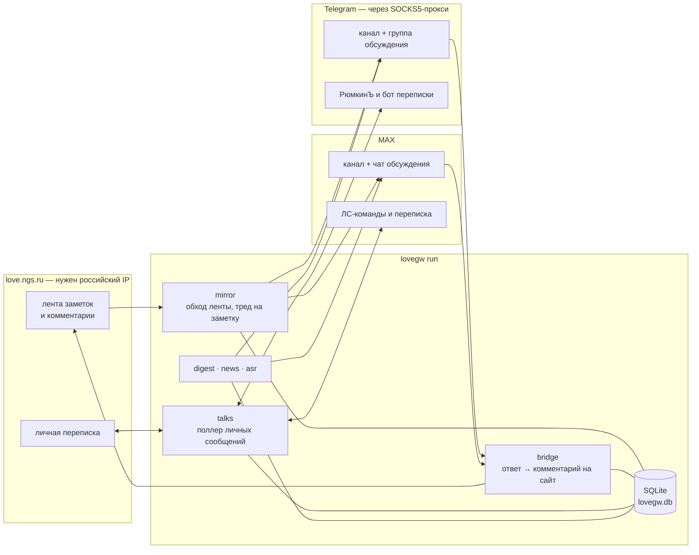

# lovegw


**Шлюз между разделом «заметки» сайта знакомств love.ngs.ru и мессенджерами.**
Заметки и комментарии зеркалятся в каналы Telegram и MAX; ответ в группе
обсуждения уходит обратно на сайт комментарием от имени написавшего — по его
сохранённой сессии. Рядом живут ЛС-бот **РюмкинЪ** (вход на сайт, публикация
заметок, подписки), доставка личной переписки сайта в мессенджер,
еженедельный дайджест, расшифровка голосовых и офлайн-архив с аналитикой
«персонажей».

Написан на Go (модуль `lovegw`, каталог [`go/`](go/)). Хранилище — SQLite без
CGo; запись сквозная, поэтому состояние переживает `kill -9`. Скрапинг —
`net/http` + goquery по HTML сайта.



Отдельно от демона у того же бинарника есть офлайн-слой: массовая выгрузка
заметок в `archive.db`, распознавание личностей (склейка альт-анкет, интересы,
отношения, атрибуция авторства) и наблюдатель за действиями модерации.

---

## Что умеет

| Что | Как это устроено |
| --- | --- |
| **Зеркало** | лента → пост в канале, комментарии → тред; свой поток на заметку с адаптивным интервалом. Комментарий постится реплаем адресату («Ник, …»), поэтому мессенджер рисует цитату |
| **Мост ответов** | ответ в группе обсуждения → комментарий на сайте под сессией автора; at-most-once через `processed_replies` |
| **Два мессенджера** | Telegram и MAX работают параллельно как независимые приёмники (`Sink`). В MAX нет нативных комментариев к каналу — тред бот заводит сам |
| **ЛС-бот РюмкинЪ** | `/login`, `/add_note`, `/add_anonymous_note`, `/status`, `/subscribe`, `/unsubscribe`, `/mysubs` + кнопочное меню |
| **Подписки** | по слову, на автора и на комментарии конкретной заметки; подписка заводится прямо из-под поста в канале, отписка — кнопкой в уведомлении |
| **Личная переписка** | входящие ЛС сайта приходят в мессенджер, ответ реплаем уходит обратно; `/talks`, `/talk`, `/delivery`. Читается только с согласия человека (чтение помечает ЛС прочитанными на сайте), получатель у сайт-аккаунта ровно один |
| **Дайджест** | еженедельный выпуск (суббота 09:00 Нск): метрики по живой БД + рубрики от Claude, публикация в каналы идемпотентна |
| **Новости проекта** | `/news` — пост админа в каналы **мимо сайта** |
| **Голосовые** | расшифровка голосовых и кружков в тредах (Nexara + ffmpeg), кэш и суточная квота на пользователя. Только Telegram — в MAX расшифровка встроена в клиент |
| **Архив и аналитика** | `archive.db`: выгрузка заметок, склейка альт-анкет, атрибуция авторства, интересы и отношения, HTML-отчёт |
| **Наблюдатель модерации** | `modwatch` ловит удаления/закрытия онлайн и сверяет их с присутствием людей на площадке |

---

## Быстрый старт

```sh
cd go
cp config.example.json config.json    # заполнить токены и id каналов
go build ./...
go run ./cmd/lovegw doctor            # конфиг, БД, сайт, токены, очередь
go run ./cmd/lovegw run -seed         # первый запуск: запомнить ленту без постинга
go run ./cmd/lovegw run               # демон
```

`-seed` нужен ровно один раз: при пустой БД запуск без него опубликует всю
текущую ленту залпом. На Windows демоном управляют батники
[`go/start.bat`](go/start.bat) / `stop.bat` / `status.bat` / `restart.bat`
(сквозная запись в SQLite делает жёсткое убийство безопасным), наблюдателем —
`modwatch-start.bat` / `modwatch-stop.bat` / `modwatch-status.bat`.

> [!IMPORTANT]
> **Сеть раздвоена.** love.ngs.ru за геоблоком DDoS-Guard: с не-российского IP —
> 403, поэтому демон и все команды, ходящие на сайт, работают с российского
> адреса. Telegram Bot API из России, наоборот, заблокирован — задайте
> `telegram_proxy`, и через прокси пойдёт только Bot API (и Claude API), а сайт
> останется напрямую. Бокс, который видит и то и другое, не требует ничего.

---

## Конфигурация

Конфиг — `go/config.json` (шаблон
[`go/config.example.json`](go/config.example.json), сам файл в `.gitignore`).
Секции:

| Секция | О чём |
| --- | --- |
| `site` | базовый URL, User-Agent, интервал запросов |
| `messengers.telegram` / `messengers.max` | гейт `enabled` + токены, id канала, чата обсуждения и админа. Старый плоский формат `mirror_bot`/`dm_bot` по-прежнему грузится как telegram-only |
| `talks` | личная переписка: интервалы, лимиты, `allow_send`, `store_text`, `retention_days`, `exclude_users` |
| `digest` | слот выпуска (`weekday`, `hour`, `tz`), `out_dir`, `auto_publish` |
| `llm` | ключ Claude API, модель, потолок токенов — рубрики дайджеста |
| `asr` | распознавание голосовых: провайдер, ключ, путь к ffmpeg, потолок длительности, суточная квота |
| корень | `notes_limit`, `signature`, `feed_interval_s`, `db_path`, `log_level`, `telegram_proxy` |

Секреты можно не класть в файл — они читаются из окружения:

| Переменная | Что задаёт |
| --- | --- |
| `LOVEGW_MIRROR_TOKEN` / `LOVEGW_DM_TOKEN` / `LOVEGW_TG_TALKS_TOKEN` | Telegram: постер, РюмкинЪ, бот переписки |
| `LOVEGW_MAX_TOKEN` / `LOVEGW_MAX_TALKS_TOKEN` | MAX: бот зеркала, бот переписки (`LOVEGW_MAX_DM_TOKEN` — устаревший псевдоним) |
| `LOVEGW_TG_PROXY` | прокси для Bot API (`http`/`https`/`socks5://…`) |
| `LOVEGW_DB_PATH` | путь к боевой БД |
| `LOVEGW_LLM_KEY` | ключ Claude API |
| `LOVEGW_ASR_*` | `ENABLED`, `PROVIDER`, `BASE_URL`, `API_KEY`, `FFMPEG`, `MAX_DURATION_SEC`, `USER_DAILY_LIMIT_SEC`, `CONCURRENCY`, `TIMEOUT_SEC` |

**Роли ботов.** Всё, что было до личной переписки, остаётся на исходных ботах
(постер + РюмкинЪ в Telegram, бот зеркала в MAX). `talks_token` уводит на
отдельного бота только переписку сайта и алерты админу; без него ничего не
меняется.

---

## Команды

Все команды — подкоманды одного бинарника: `go run ./cmd/lovegw <команда> …`
(или собранный `lovegw <команда> …`). Флаги можно писать и до, и после
позиционных аргументов (`crawl notes -save-html dir` работает). У всех команд,
читающих конфиг, есть `-config config.json` — путь относительный, поэтому
запускать удобнее из `go/`.

| Команда | Зачем |
| --- | --- |
| [`run`](#демон-и-эксплуатация) | боевой демон: зеркало, мост, ЛС-боты, переписка, дайджест |
| [`doctor`](#демон-и-эксплуатация) | диагностика конфига, БД, сайта, токенов, очереди |
| [`pull`](#демон-и-эксплуатация) | завести заметку по прямому id, минуя ленту |
| [`repost`](#демон-и-эксплуатация) | снести заметку из мессенджера и БД для перепоста |
| [`import`](#демон-и-эксплуатация) | разовый импорт состояния Python-версии |
| [`digest`](#дайджест) | недельный выпуск: `draft` → правка → `preview` → `publish` |
| [`talks watch`](#личная-переписка) | безопасный read-only прогон поллера переписки |
| [`crawl`](#отладка-парсинга) | разобрать ленту/комментарии, записать фикстуры |
| [`grab` · `export` · `backfill`](#архив-archivedb) | офлайн-архив заметок |
| [`personas …`](#персонажи-personas) | аналитика поверх архива |
| [`modwatch`](#наблюдатель-модерации-modwatch) | ловля действий модерации и сверка с присутствием |

### Демон и эксплуатация

```sh
lovegw run    [-seed]
lovegw doctor [-post-test]
lovegw pull   [-db lovegw.db] [-full] <note_id> [<note_id> …]
lovegw repost <note_id> [<note_id> …]
lovegw import [-notes notes.json] [-sessions sessions_export.json] [-subscribers subscribers.json]
```

- **`run`** — зеркалирование ленты и комментариев, мост «ответ в группе →
  комментарий на сайте», ЛС-боты, поллер переписки, планировщик дайджеста и
  распознавание голосовых — всё под одним errgroup. Что именно поднимется,
  решают гейты `enabled` в конфиге.
- **`doctor`** — конфиг, БД, доступ к сайту, токены ботов, очередь обновлений.
  `-post-test` дополнительно проверяет цепочку «пост в канал → автофорвард в
  группу» тихим самоудаляющимся сообщением (безопасно на живом канале).
- **`pull`** — спасение заметки, которую не увидел обход ленты (уехала из окна
  за время простоя): заводит её по прямому id со статусом `pending`, дальше
  работает обычная логика демона. `-full` дотягивает весь тред и возвращает
  архивную заметку в отслеживание. Безопасна при работающем демоне.
- **`repost`** — удаляет заметку из мессенджера (пост, тред, комментарии,
  иллюстрации) и из БД, чтобы демон опубликовал её заново по текущей логике.
  Отладочная команда — запускать при остановленном демоне.
- **`import`** — разовый идемпотентный импорт JSON-состояния старой
  Python-версии (`INSERT OR IGNORE`); можно указывать любое подмножество файлов.

### Дайджест

```sh
lovegw digest [-db lovegw.db] [-week N] [-out dir] [-llm] [-force] draft
lovegw digest [-db lovegw.db] [-week N] [-in draft.txt] [-to telegram|max] preview
lovegw digest [-db lovegw.db] [-week N] [-in draft.txt] [-to telegram|max] publish
```

Слот выпуска — **суббота 09:00 Нск**: он задаёт и время публикации, и шов
недели, поэтому стоит в утренней тишине (вечерний срез рассекал бы суточный пик
21:00–22:00 пополам). `draft` считает рубрики по живой БД (заметка недели, спор,
цитата, новые лица, рекорды) и кладёт рядом `materials.md` с промптами;
`-llm` заполняет рубрики через Claude API, иначе их заполняет админ вручную.
`preview` рендерит выпуск под конкретный мессенджер, `publish` постит.
Публикация идемпотентна и резюмируема через `message_targets`, поллинг команда
не поднимает — запускать можно при работающем демоне.

При `digest.enabled` планировщик делает это сам: в слот строит черновик, при
настроенной секции `llm` заполняет рубрики, и либо публикует (`auto_publish`),
либо зовёт админа в ЛС. Пропущенный слот догоняется в течение 48 часов.

### Личная переписка

```sh
lovegw talks -db <копия.db> [-once] [-interval 20s] [-max-dialogs N] [-history-limit N] watch
```

Прогон **только** поллера ЛС, без зеркала и без long polling: читает диалоги под
сессией админа и доставляет входящие в его личку методом `SendMessage`, поэтому
не конфликтует с боевым демоном на тех же токенах. Жёстко read-only:
`allow_send=false`, на сайт ничего не пишется. Работает по **копии** БД —
открытие мигрирует схему.

> [!WARNING]
> Переписку читают **только с согласия человека**: чтение истории помечает
> сообщение прочитанным на самом сайте (собеседник видит «просмотрено») и всё
> это время показывает человека в сети. Пока согласия нет, сайт-аккаунт не
> трогают вовсе, а бот один раз спрашивает кнопками — у CLI кнопок нет, поэтому
> `talks watch` обходит только согласившихся.
>
> У сайт-аккаунта при этом ровно один получатель ЛС: второй сессии того же
> человека достанется пустота. Кнопка «читать и присылать сюда» отвечает сразу
> на оба вопроса, дальше настройка живёт под `/delivery`.

### Отладка парсинга

```sh
lovegw crawl notes                [-save-html dir]
lovegw crawl comments <note_id>   [-save-html dir]
```

Разбирает ленту или страницу комментариев и печатает JSON. `-save-html`
записывает сырую страницу как фикстуру парсера — при дрейфе вёрстки
перезаписывайте фикстуры в `internal/love/testdata/` этой же командой:

```sh
lovegw crawl notes -save-html internal/love/testdata
lovegw crawl comments <note_id> -save-html internal/love/testdata
```

### Наблюдатель модерации (modwatch)

```sh
lovegw modwatch [-db modwatch.db] [-feed-interval 90s] [-thread-interval 5m] [-window 48h]
                [-depth 6h] [-max-threads N] [-pages N] [-once] watch
lovegw modwatch [-db modwatch.db] [-since 72h] [-until …] [-kind note_gone,comment_gone,…]
                [-age-min D] [-age-max D] [-presence-window 5m] [-controls N] [-min-hits N] [-top N] report
lovegw modwatch [-db modwatch.db] [-since 72h] [-kind …] [-limit N] events
lovegw modwatch [-db modwatch.db] status
```

Поля «модератор» на сайте нет, а архив хранит только уцелевшее — что именно
исчезло, видно лишь онлайн. `watch` пишет в **отдельную** `modwatch.db` моменты,
которых нет в архиве: заметка появилась или ушла из ленты, комментарий пропал
из треда, добавилась иллюстрация, закрыли комментарии, сменился ник — с окном
неопределённости и контекстом действия (возраст объекта, тишина в треде,
число реплик). `report` сверяет эти минуты с присутствием людей: для каждого
события окно сравнивается с контрольными, сдвинутыми на целые сутки и
выровненными по числу реплик. Только чтение сайта, боевую БД не трогает, с
работающим демоном совместим.

> [!NOTE]
> Единица наблюдения — **окказия** (заметка + такт опроса), а не событие: чистку
> треда наблюдатель видит разом. Верхушку отчёта нельзя читать как список имён —
> порог не откалиброван на множественную проверку, а анкеты, живущие меньше
> периода наблюдения, не попадают в контроль и получают значимость даром.

### Архив (archive.db)

Отдельная БД (по умолчанию `data/archive.db`, флаг `-db`) для офлайн-анализа:
users/notes/comments, дерево ответов через `parent_id`, типажи дедуплицированы
по id анкеты.

```sh
lovegw grab   [-db archive.db] [-json] [-out dir] [-save-html dir] [-view tree|linear] [-max-pages N] <note_id>
lovegw export [-db archive.db] [-out dir] <note_id>
lovegw backfill [-db archive.db] [-proxy] [-workers N] [-interval-ms MS] [-from ID] [-to ID]
                [-start-page N] [-refresh] [-limit N]
```

- **`grab`** — разовая выгрузка одной заметки со всеми страницами комментариев
  с сайта в `archive.db` (только чтение, без кук). `-json` дополнительно пишет
  денормализованный снимок `<id>.json` в `-out`.
- **`export`** — полностью офлайн: собирает заметку из `archive.db` во
  вложенное JSON-дерево `<id>.json` (для визуализаций и внешних инструментов).
- **`backfill`** — массовая выгрузка диапазона: перечисляет живые id обходом
  ленты и внахлёст скармливает их пулу воркеров. Идемпотентна — после остановки
  или 403 достаточно перезапустить. `-proxy` гонит сайт через `telegram_proxy`
  (беречь основной IP), `-from`/`-to` — границы id (по умолчанию от 240866 —
  старее комментарии уже удалены с самого сайта), `-start-page` — с какой
  страницы ленты начинать, `-refresh` — пере-обходить уже загруженные (нужен,
  чтобы подобрать новые комментарии в старых тредах).

### Персонажи (personas)

Слой распознавания личностей поверх `archive.db`: вероятностная, ревью-гейтед
склейка альт-анкет одного человека в «личности», плюс интересы, отношения,
атрибуция авторства и стилевые карты. Общие флаги: `-db archive.db`,
`-out dump` (каталог выгрузок).

Основной конвейер склейки — текстовые самораскрытия:

```sh
lovegw personas flag [-patterns file]        # скан комментариев по шаблонам самораскрытия → disclosure_hits
lovegw personas candidates [-limit N]        # выгрузка непроработанных помет с контекстом (hits.jsonl + users_index.json)
# … внешний LLM-проход по hits.jsonl → links.json …
lovegw personas link [-in links.json]        # импорт извлечённых связей в alias_candidates
lovegw personas cluster [-min-score F] [-max-persona N] [-min-density F]
                                             # склейка связных компонент в personas + отчёт
lovegw personas set <persona_id> <confirmed|rejected|pending>   # вердикт после ревью
```

`cluster` защищён гардами от транзитивной переклейки: `-max-persona`
(компонент крупнее — не склеивать) и `-min-density` (минимальная плотность
рёбер для компонент больше 4 анкет).

Слой адресатов и настоящее дерево ответов — фундамент всего социального графа:

```sh
lovegw personas addressees                                        # кому реально адресована каждая реплика
lovegw personas replies [-from ISO] [-limit N] [-max-comments N] [-retry]   # цели ответа с мобильной версии сайта
```

Дерево комментариев на сайте двухуровневое: `parent_id` указывает на корень
ветки, а настоящий адресат — в тексте («Ник, …»). `addressees` восстанавливает
его полным проходом по архиву (операция разовая и тяжёлая, пересчёт
идемпотентен), `replies` дополняет его точными парами «реплика → та, которой
отвечают» со страниц `m.love.ngs.ru`, где сайт эту связь отдаёт честно.

<details>
<summary><b>Дополнительные сигналы склейки и диагностика</b></summary>

```sh
lovegw personas avatars fetch  [-proxy] [-workers N] [-limit N] [-refresh]   # скачать аватары, посчитать dHash
lovegw personas avatars cluster [-max-dist D] [-generic-max N]               # пары по похожести аватаров
lovegw personas stylometry build   [-min-chars N] [-dims N] [-genre all|notes] # стилевые профили авторов
lovegw personas stylometry cluster [-min-cosine F] [-top-k N] [-max-pairs N] # пары по близости стиля
lovegw personas lexis build        [-lex-min-tokens N] [-lex-dims N] [-genre all|notes] # лексические TF-IDF-профили
lovegw personas ensemble [-ens-top-k N] [-handoff-days D] [-ens-floor F]     # композит: стиль + handoff + круг общения
```

```sh
lovegw personas portrait [-top N] <p<id>|u<id>|user_id>   # портрет личности/анкеты: стиль, собеседники
lovegw personas diag <id> <id> …                          # ground-truth сверка набора анкет (стиль/собеседники/время)
```

</details>

<details>
<summary><b>Атрибуция авторства: attribute · calibrate · verify · anon</b></summary>

```sh
lovegw personas attribute [-top N] [-note id] [-in text.txt] [-lex-weight F] [-active-days N]
                          [-min-author-notes N] [-genre notes] [текст …]
                          # чьё письмо ближе к анонимному тексту (стиль + лексика);
                          # -active-days убирает мёртвые анкеты, -min-author-notes — чистых
                          # комментаторов без заметок (атрибутируем-то заметку)
lovegw personas attribute [-author p<id>] [-lex-weight F] [-genre notes]   # пакет: все заметки личности + сводка попаданий
lovegw personas calibrate -notes id,id,… [-author p<id>] [-active-days N] [-min-author-notes N] [-genre notes]
                          # leave-one-out: предсказуемость автора и эффект фильтров
lovegw personas verify -suspect p<id> [-in txt|-notes ids|-note id] [-null N] [-active-days N]
                       [-min-author-notes N] [-genre notes]
                          # «это он? да/нет» с калиброванным порогом (FPR 5 %/1 %)
lovegw personas anon -suspect p<id> [-from ISO] [-to ISO] [-min-text N] [-top N] [-null N]
                          # прогнать анонимные заметки через скоринг подозреваемого
```

**Жанр эталона `-genre`** (по умолчанию `all` — комментарии + заметки, обратная
совместимость): у большинства авторов профиль на 2/3 состоит из комментариев —
другой жанр, чем заметка-запрос (короткая реплика vs текст), и это системная
ошибка сопоставления. `-genre notes` строит и грузит эталон **только из
заметок** (register-matched): и запрос, и профиль — один регистр. Note-слой есть
только у писавших заметки, поэтому `-min-author-notes` для него встроен по
построению. Порядок: сначала `stylometry build -genre notes` (+ при желании
`lexis build -genre notes`), затем `attribute/calibrate/verify -genre notes`.

Выдача `anon` читается только вместе с ожидаемым числом ложных срабатываний и
контролем — вторым автором той же эпохи.

</details>

<details>
<summary><b>Манера письма и генерация в чужом голосе (voice)</b></summary>

```sh
lovegw personas voice card <p<id>|u<id>|user_id> [-genre notes|all] [-recent N]
                           [-samples N] [-band N] [-seed N] [-top-words N] [-solo]
```

Профили атрибуции — хешированные необратимые векторы: по ним нельзя ни сказать,
как звучит человек, ни проверить их глазами. `voice card` меряет манеру по
сырому тексту: квантили длин, предложения и абзацы, пунктуация на 1000 рун,
**скобочная подпись** отдельно от частот («)» и «))» — разные люди), регистр и
финальный знак, разметка сайта и смайлы, обращения «Ник, …», часы активности и
характерная лексика. Карта детерминирована: тот же `-seed` на той же БД даёт ту
же выборку. LLM и конфиг не нужны. `-solo` меряет **одну анкету**, без склейки
личности — иначе карта усредняет все склеенные анкеты, в том числе чужих эпох.

Корпус режется на **образцы** (`-samples`) и непересекающийся **held-out**
(`-band`) — второй нужен замкнутому циклу генерации как эталонная полоса, и
пересечение сломало бы замер. `-samples 0` — режим, в котором дословные тексты
участника вообще никуда не уходят. `-recent` ограничивает замер последними
текстами (индекс `idx_comments_author` не покрывает `text`, у плотного
комментатора это десятки тысяч чтений с диска); в отчёте всегда видно и замер,
и полный знаменатель.

Вес характерных слов берётся у **корзины хэша** из готового `lexis_meta`, а не
у слова, — это экономит проход по 10,7 млн комментариев. Читать так: вес корзины
— нижняя оценка редкости слова (частое слово в корзине тянет его вниз), поэтому
верх списка надёжен, а низ не значит ничего.

```sh
lovegw personas voice note <token> [-topic "…"] [-drafts N] [-rounds N]
                           [-control p<id>] [-accept F] [-max-copy F]
lovegw personas voice comment <token> -reply-to <comment_id> [-control p<id>]
lovegw personas voice comment <token> -note <note_id>        [-control p<id>]
```

`-reply-to` — ответ внутри ветки (адресат и обращение «Ник,» подставляются
инструментом), `-note` — комментарий первого уровня к самой заметке: адресата
нет, а корневые реплики треда идут в промпт как «уже сказанное».

Образцы и словарь берутся от **рода** текста, который пишем, а не от жанра
эталона: комментарий учится на комментариях, даже когда слой атрибуции `all`.
Образец-реплика подаётся парой «на что отвечает → что ответил»: короткая реплика
в отрыве от чужих слов манеру не показывает. Число образцов по умолчанию
считается по медиане корпуса (короткие реплики — 24, средние — 12, длинные — 6).

Список характерных слов подаётся **не как цель**: рядом печатается норма самого
автора (слов из списка на 100 слов), дифф ругает и перебор, и недобор, а
черновик с частотой выше нормы ×3 отбраковывается до скоринга. Иначе модель
набивает список и поднимает лексический косинус, обрушив стилевой.

Карта и образцы уходят в Claude (`llm.api_key` / `LOVEGW_LLM_KEY`, через
`telegram_proxy`), K черновиков возвращаются одним запросом, каждый прогоняется
через **собственную атрибуцию архива**. Голый ранг ничего не значит — на
машинном тексте атрибуция заведомо слаба, — поэтому он читается против
**эталонной полосы**: рангов реальных held-out текстов того же человека.
Критерий приёмки — квантиль полосы (`-accept`, по умолчанию 0.25), а не порог
по рангу: у одного автора его собственные заметки лежат на 1–26, у другого на
40–3000.

Полоса **оптимистична**: её тексты входят в стиль-профиль автора, а черновик —
нет. Это считается (доля профиля, которую даёт один текст полосы) и печатается;
выше 5 % полоса не строится вовсе, и отчёт говорит почему. Кроме контаминации
полоса отказывается ещё в двух случаях: больше половины её текстов короче порога
объёма, либо её медиана лежит дальше половины списка — тогда слой не узнаёт и
настоящие тексты автора, и сравнивать не с чем.

`-control <token>` строит вторую полосу и скорит те же черновики против чужой
личности. Правило чтения: **если контроль не ниже цели, атрибутор на машинном
тексте людей не различает и вердикт цикла отбрасывается целиком.** Без
`-control` отчёт честно предупреждает, что прогон не интерпретируется.

Второй раунд получает не «попробуй ещё», а измеримый дифф: дельты длины,
предложений и пунктуации, отсутствующие «))», лишняя финальная точка,
неиспользованные характерные слова и слова, которых у автора нет ни разу.
Раундов максимум 3 — цикл взбирается по хешированной метрике, и дальше модель
начинает набивать признаки вместо манеры. Черновик, пересказывающий образец,
отбраковывается стражем копирования (`-max-copy`).

Инструмент исследовательский: пишет только в `<out>/voice/`, каждый артефакт
несёт марку машинной генерации, пути публикации на сайт или в мессенджеры нет
(закреплено тестом на список импортов, а не комментарием).

</details>

<details>
<summary><b>Интересы, отношения, пол анкет, итоговый отчёт</b></summary>

Факты (интересы) и отношения — тот же паттерн «scan/score → candidates →
внешний LLM → import»:

```sh
lovegw personas facts scan [-topics file] [-min-hits N] [-min-notes N] [-evidence N]
lovegw personas facts candidates [-min-hits N] [-min-notes N]      # → facts.jsonl на LLM-разметку
lovegw personas facts import [-in facts_llm.json]                  # → identity_facts

lovegw personas relations score [-rel-min-replies N]               # тон направленных пар по эвристикам
lovegw personas relations candidates [-cand-replies N] [-band-min N] [-band-top N] [-exchanges N]
                                                                   # → pairs.jsonl на LLM-разметку
lovegw personas relations import [-in relations_llm.json]          # → relation_edges
```

Пол анкет — обходом их профилей через мобильную версию сайта (десктопная банит
серию запросов почти мгновенно, мобильный vhost терпит):

```sh
lovegw personas gender [-active-days N] [-tg-user id] [-limit N]
```

Ходит под сессией сайта из БД бота (`-tg-user`, по умолчанию
`admin_tg_user_id`; нужен `/login` в РюмкинЪ). Идемпотентно — обходятся только
анкеты без пола, волны 403 пережидаются с нарастающей паузой, так что остаток
добирается простым перезапуском.

```sh
lovegw personas report [-report-top N] [-active-days N] [-html]
```

Сводка «персонажей»: топ личностей, интересы, отношения. `-active-days N`
ограничивает когорту активными за последние N суток, `-html` дополнительно
собирает `characters.html`.

</details>

---

## Развёртывание (Docker)

Боевой запуск — в контейнере: multi-stage сборка (`CGO_ENABLED=0`) →
`distroless/static`, образ ~100 МБ (бинарник ~23 МБ плюс статический `ffmpeg`
для распознавания голосовых). Из одного образа поднимаются **два** сервиса:
`lovegw` (демон) и `modwatch` (наблюдатель, своя БД, сайт только на чтение).

```sh
cd deploy
docker compose up -d --build
```

Артефакты и пошаговый рунбук — в [`deploy/`](deploy/): [`go/Dockerfile`](go/Dockerfile),
`docker-compose.yml`, systemd-юнит, шаблон секретов, подробности —
[deploy/README.md](deploy/README.md). Конфиг монтируется как `/config.json`,
состояние — в `/data` (uid 65532: distroless работает под `nonroot`), секреты —
через env. Повторная сборка после правки исходника укладывается в ~40 секунд за
счёт кэш-маунтов BuildKit.

Хост нужен с **российским IP**; Telegram Bot API идёт через SOCKS5-прокси. При
включённом MAX PEM-ы Минцифры должны лежать в `go/internal/maxx/cacert/`
**до** сборки — в distroless-образе нет российского корневого CA.

---

## Разработка

```sh
cd go
go build ./... && go vet ./... && go test ./...
```

`-race` требует cgo — гонять на Linux/CI. Селекторы вёрстки сайта собраны в
одном const-блоке [`internal/love/parse.go`](go/internal/love/parse.go); тесты
идут на реальных записанных фикстурах в `internal/love/testdata/`. Обязательный
селектор, не нашедший элемент, возвращает типизированную `MarkupError` —
детекция дрейфа вёрстки, о которой демон предупреждает админа в ЛС.
Идентификаторы — по-английски, комментарии и строки бота — по-русски.

### Карта пакетов

| Пакет | Ответственность |
| --- | --- |
| [`love`](go/internal/love/) | клиент сайта, парсеры, авторизация, cookie-сессии |
| [`store`](go/internal/store/) | SQLite — единственный источник правды; схема v8, миграции по `PRAGMA user_version` |
| [`mirror`](go/internal/mirror/) | обход ленты + поток на заметку, fan-out по приёмникам, уведомления подписчиков |
| [`bridge`](go/internal/bridge/) | ответ в мессенджере → комментарий на сайте, at-most-once |
| [`tgx`](go/internal/tgx/) | обёртка go-telegram/bot: лимитеры, ретрай 429, HTML, кэш `file_id`, прокси |
| [`maxx`](go/internal/maxx/) | сторона MAX поверх официального SDK: канал, ручной «автофорвард», клавиатуры, long polling |
| [`dmbot`](go/internal/dmbot/) | РюмкинЪ: messenger-agnostic диалоговое ядро, кнопки, вторая роль — бот переписки |
| [`talks`](go/internal/talks/) | поллер личной переписки сайта и выбор получателя |
| [`digest`](go/internal/digest/) | недельный выпуск: метрики, черновик, планировщик, рендер под мессенджер |
| [`news`](go/internal/news/) | новости проекта: пост админа в каналы мимо сайта |
| [`asr`](go/internal/asr/) | расшифровка голосовых: очередь, квоты, кэш, Nexara + ffmpeg |
| [`llm`](go/internal/llm/) | клиент Claude API со structured outputs (через прокси) |
| [`chantext`](go/internal/chantext/) | общее HTML-подмножество каналов: валидация, видимая длина, обрезка |
| [`kbd`](go/internal/kbd/) | листовой пакет типов клавиатур и payload'ов кнопок |
| [`alerts`](go/internal/alerts/) | троттлер алертов админу: сообщение на N сбоев подряд и одно на восстановление |
| [`archive`](go/internal/archive/) | офлайн-архив и весь слой персонажей; схема v18 |
| [`modwatch`](go/internal/modwatch/) | наблюдатель за действиями модерации, своя БД и case-control анализ |
| [`legacy`](go/internal/legacy/) | разовый импортёр старого JSON-состояния |

### Где ещё почитать

| Документ | О чём |
| --- | --- |
| [CLAUDE.md](CLAUDE.md) | архитектурные инварианты и решения — почему сделано именно так |
| [docs/backlog.md](docs/backlog.md) | эпики и планы: кнопки, подписки 2.0, поиск, дайджест, своя площадка |
| [deploy/README.md](deploy/README.md) | пошаговый рунбук боевого развёртывания и обслуживания |
| [docs/](docs/) | брифы отдельных задач (атрибуция, генерация в чужом голосе) |

---

## Данные и приватность

> [!CAUTION]
> Настоящие секреты живут только в рабочей копии: токены ботов — в
> `go/config.json`, живые cookie-сессии пользователей — в SQLite (`data/`,
> таблица `sessions`). Всё это в `.gitignore` — не печатать, не коммитить, не
> копировать в примеры и логи, проектную секцию `.gitignore` не ослаблять.

Тексты личной переписки по умолчанию не хранятся (`talks.store_text: false`), а
то, что сохранено, чистится по `retention_days`. Аналитические артефакты
(`dump/`, досье, выгрузки архива) — внутренние документы и в репозиторий не
попадают.
